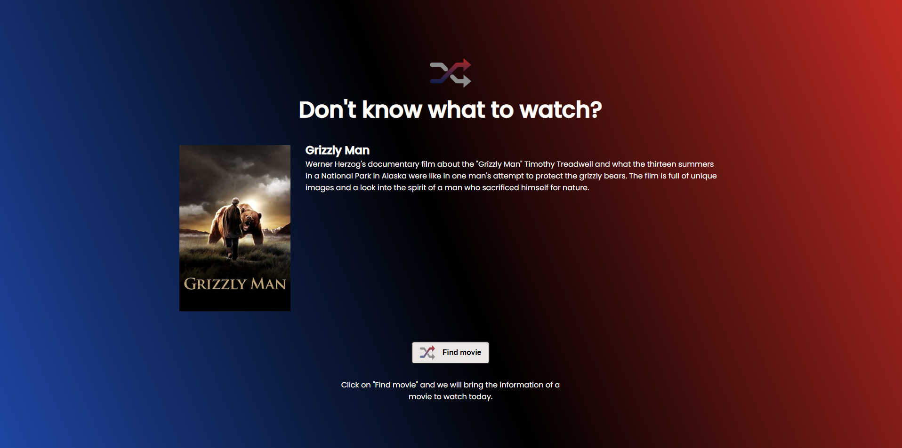

# Rocketflix

> Rocketseat "Rocketflix" challenge

Project made for the Rocketflix challenge from Rocketseat. the challenge consists in making a page for movie suggestions using the themoviedb.org API. For security purposes and to not leak my API key, I made a backend using NodeJS to make the API requests for the frontend.

The frontend was made using HTML, CSS, Typescript, ReactJS and Vite. Deployed via Github Pages.

The backend was made using NodeJS, Express, Cors, Prisma and PostgreSQL. Deployed via Heroku.

[🔗 Click here to visit](https://andremayert.github.io/rocketflix-frontend/)

## 🛠 Tech

- HTML
- CSS
- Typescript
- API
- React
- NodeJS
- Express
- Cors
- Prisma
- PostgreSQL
- Git and Github
- Vite
- NPM

## 💛 Contact

andremayerusa@gmail.com
